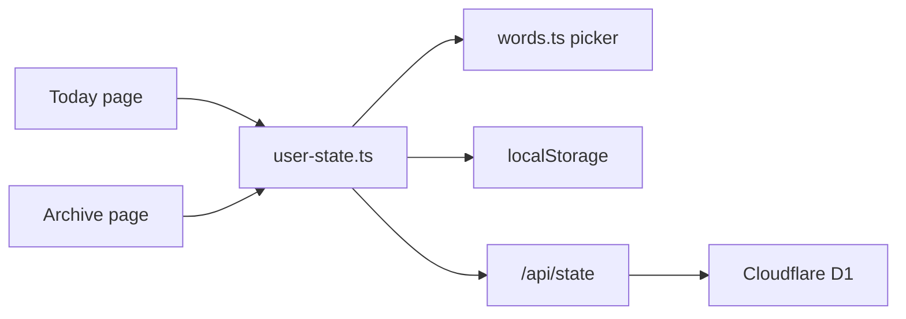

# Code map

## Layout

```
src/lib/words.ts              # entry list + one-a-day picker
src/lib/user-state.ts         # local progress, sentences, optional D1 sync
src/lib/format.ts             # readable dates and kind labels
src/routes/+layout.ts         # ssr off; this app is local-first
src/routes/+layout.svelte     # paper page + English / Today / Archive
src/routes/+page.svelte       # today's entry + write-a-sentence + skip
scaffold/skills/add-entries/  # how to generate the next batch of entries
src/routes/archive/+page.svelte
src/routes/api/state/+server.ts   # D1 read/write
src/app.css                   # literary theme
migrations/001_init.sql       # progress table
static/manifest.webmanifest
```

## Flow



Today asks `getTodaysEntry`. If I already wrote a sentence for this date, I see that entry. If I skip, the term is stored as skipped (and any sentence for it is dropped) and today redraws. If I write a sentence, it is stored with today's date and shows up in the archive.

## State

- Entry list: `src/lib/words.ts` (`entries`)
- My progress: browser localStorage key `english-vocab:user-state:v1`
- Optional copy of that progress: D1 `progress` row keyed by `userId`
